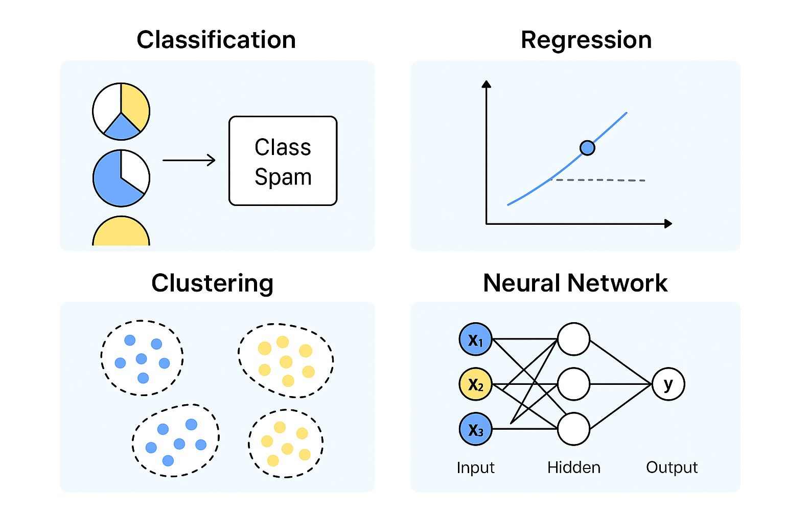

# Machine Learning Algorithms

## Classification

Goal: Predict a category or class from input data.

How it works:
- You give the model examples with known labels.
- It learns patterns that separate one class from another.
- When given new data, it predicts the most likely class.

Types:
- Binary classification: Only 2 classes (spam / not spam).
- Multi-class classification: More than 2 classes (cat / dog / rabbit).

Examples:
- Email spam filter.
- Diagnosing a medical condition (disease present / absent).

## Regression

Goal: Predict a continuous number instead of a category.

How it works:
- The model finds a mathematical relationship between input features and the output number.
- Output can be any real value, not just fixed options.

Examples:
- Predicting house prices from size, location, and age.
- Forecasting tomorrow’s temperature.

## Clustering

Goal: Group similar things together without telling the model the groups beforehand.

How it works:
- It looks for patterns or similarities in the data.
- Points that are more similar get grouped into the same “cluster.”

Examples:
- Grouping customers into buying-behavior segments.
- Organizing similar news articles.

## Neural Network

Goal: Learn complex patterns using a network of connected nodes called neurons.

How it works:
- Neurons are arranged in layers:
    - Input layer: Receives data (e.g., pixel values from an image).
    - Hidden layers: Transform the data using mathematical operations.
    - Output layer: Produces the prediction.
- Each connection has a weight (importance), which is adjusted during training to improve accuracy.

Why use it:
- Can handle very complex data like images, speech, and natural language.

Examples:
- Face recognition in social media apps.
- Voice assistants like Alexa/Siri.

## Decision Trees

Think of a decision tree like a flowchart or a series of yes/no questions that help you make a decision.
- At the top, you start with one big question.
- Depending on the answer, you go down a branch to the next question.
- You keep going until you reach a final decision (leaf node).

Example:

If you’re deciding whether to play outside:
- Is it raining? → Yes → Stay inside.
- Is it raining? → No → Is it hot? → Yes → Wear a cap; No → Go outside as you are.

In ML, decision trees split data based on the most important features to predict an outcome.

## Linear Regression

Linear regression is about finding a straight-line relationship between inputs and an output.
- It assumes that as one thing changes, the other changes in a predictable way.
- The “line” is the best fit through the data points.

Example:

Predicting house prices based on size:
- Bigger houses usually cost more, so the line goes up as size increases.
- The model learns that relationship so it can estimate prices for new house sizes.

## Visual Explanation

